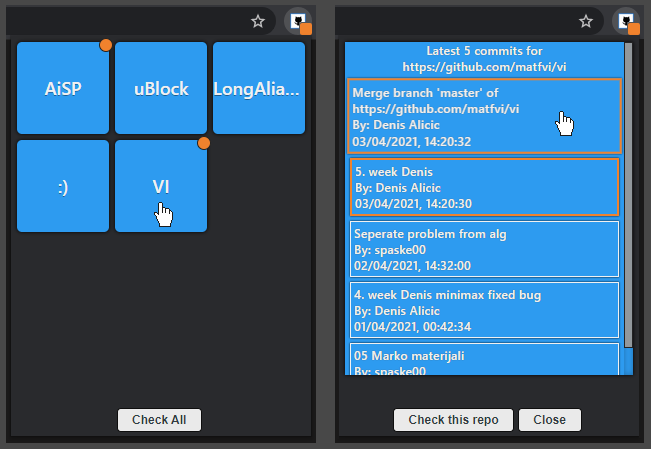
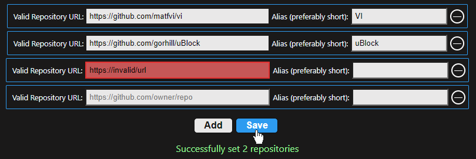
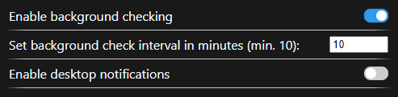
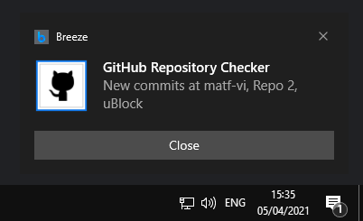
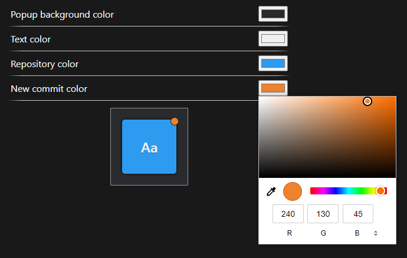

ℹ️ _This was a practice project early into my SD career, don't judge the code too much_ :)

## GitHub Repository Checker

A Chromium browser extension that provides quick and easy GitHub repository commit checking.
Manually or periodically check up to 9 repositories and display new commits.
Originally intended for colleagues at my university waiting on exam results.

Written using React[[1]](#1) and Redux.[[2]](#2)

### Features

#### Popup

- Choose between checking all repositories or individual ones
- Repositories with new commits get a notification badge
- New commits are highlighted in the color of the badge
- Commits are clickable and open the commit on GitHub in a new tab

- The popup icon (browser action) gets a notification badge when new commits are detected during a background check

#### Options page

The options page allows users to set repositories they want to keep track of and set their respective aliases, set background checking options and customize the popup colors.

##### Repository settings

- Repository links go through a RegEx check to make sure they match the placeholder template
- Nonexistent but valid repository links will simply display no commit data

##### Background settings

- HTML inputs allow users to manually type values lower/higher than specified, but the setting defaults to 10 in the background if that is detected, do not be evil to the GitHub API
- Enabling desktop notifications will produce a notification in the bottom right corner of the screen if new commits are found, with a default name for repositories with no alias set

##### Color settings

- A live preview of the various popup colors that can be customized

### Permissions

Being that the extension will be installed as an unpacked extension, your browser won't prompt you to accept the `permissions`[[3]](#3) it requires.

    "permissions": [
      "storage",
      "tabs",
      "notifications",
    ],

These permissions allow access to their respective APIs which are used in the following way:

**`storage`**[[4]](#4)

- Store repository lists with accompanying commit data, background checking settings and color settings

**`tabs`**[[5]](#5)

- Open commit GitHub links in a new tab when clicked

**`notifications`**[[6]](#6)

- Create the new commits notification if the option is enabled by the user

### Installation

- Clone the repository
  `git clone https://github.com/dragoljubm/github-repo-checker `
- Navigate to your browser's extensions page and enable `Developer mode` in the top right corner
- Load the `dist` folder via `Load unpacked` in the top left corner of the extensions page

### Development

##### Requirements

- Latest version of Node.js

##### Steps

- Install dependencies
  `npm install`
- Run the dev server
  `npm run dev`
- or get a production build :
  `npm run build`

## References
<a id="1">[1]</a> [React](https://reactjs.org/): A JavaScript library for building user interfaces

<a id="2">[2]</a> [Redux](https://redux.js.org/): A Predictable State Container for JS Apps

<a id="3">[3]</a> Chrome Developers API Reference: [Declare permissions](https://developer.chrome.com/docs/extensions/mv2/declare_permissions/)

<a id="4">[4]</a> Chrome Developers API Reference: [chrome.storage](https://developer.chrome.com/docs/extensions/reference/storage/)

<a id="5">[5]</a> Chrome Developers API Reference: [chrome.tabs](https://developer.chrome.com/docs/extensions/reference/tabs/)

<a id="6">[6]</a> Chrome Developers API Reference: [chrome.notifications](https://developer.chrome.com/docs/extensions/reference/notifications/)
